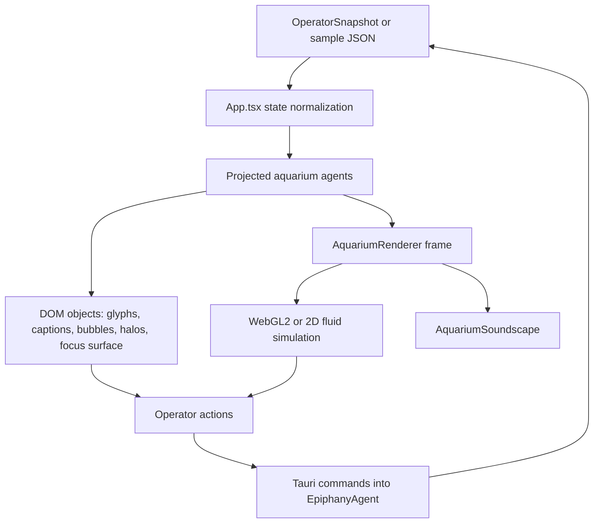

# Aquarium Behavior Map

Last mapped: 2026-05-05

## Objective

Make the aquarium cuter by first making its current behavior explicit. Cute has
to be a control grammar, not glitter on a console. The live artifact has made a
good first move: idle water and agents fill the screen, and work surfaces appear
only after interacting with an agent object. The core design debt is that the old
operator console still survives inside that reveal. It is gated, but not yet
broken down into aquarium-native organs.

## Runtime Shape

The app has five cooperating layers:

1. **Snapshot bridge.** `src/operatorApi.ts` loads live Tauri data when running
   in the desktop shell, or `public/operator-snapshot.sample.json` in browser
   dev mode. Actions follow the same split: Tauri invokes the backend, browser
   mode returns a small sample action receipt.
2. **React projection.** `src/App.tsx` normalizes snapshot state into decks,
   subdecks, action eligibility, agent status, thoughts, jobs, review hints, and
   graph data.
3. **Aquarium objects.** `AgentConstellation` turns eight roles into visible DOM
   creatures: Self, Face, Imagination, Eyes, Body, Hands, Soul, and Life. The
   creature body is the Three.js 3D object; the centered DOM caption is its ID
   tag, hit target, and billboard root. Radial option buttons open around that
   central tag, and leaf surfaces unfold from that local graph. The renderer
   draws thin dashed orbit guides behind them and keeps their motion spring-
   tethered to those orbit slots while allowing pointer attraction. Self is not
   a separate physics class; it has the same spring body as every other
   creature. Agents are projected as hovering objects above gravity cups, not as
   points embedded in the surface. Their grid coordinates project through a
   tilted near-omniscient camera before reaching DOM.
4. **Three field layer.** `src/aquariumScene3d.ts` owns the visible 3D grid,
   hovering agent bodies, cursor landing object, and Aetheria-style gravity
   texture. Agent wells and low chirp-bank modes are rendered as additive
   top-down splat quads into a grid-aligned render target; the visible mesh
   samples that accumulated texture for displacement. Camera distance drives
   both procedural grid cell size and actual field extent, while gravity wells
   remain in stable world coordinates. The scene is Z-up over a shared XY
   interaction plane, with middle-drag orbit, wheel zoom, and right-drag/WASD
   panning around that plane.
5. **Fluid and crisp canvas.** `src/aquariumFluid.ts` owns WebGL2 fluid
   simulation, fallback 2D rendering, hit zones, projection frames, fluid
   controls, and canvas-local picking. The smoke canvas now renders an
   Aetheria-style PowerPulse heightfield under the dye: wells, slope shading,
   contour lines, and sparse particle-like stardust. The crisp canvas carries
   readable overlay marks and simulation-owned controls.
6. **Stardust compatibility shim.** `src/aquariumStardust.ts` now only records
   that stardust is composited by the Three scene. The former WebGPU overlay was
   screen-space, so it is disabled until its compute model can feed the shared
   3D/HDR compositor directly.
7. **Soundscape.** The same renderer lazily creates an `AudioContext`. Agents
   get vocal chirp/spectral behavior; interface controls get one short
   subtractive resonator hit per deliberate pointer gesture.

## Data Flow

## Interaction Grammar

- **Idle:** fullscreen water, drifting agents, crisp labels, ambient state, no
  focus surface. The initial screen is aquarium-first, not paperwork-first.
- **Hover/touch agent:** the renderer marks that agent hot, emits CSS projection
  variables, applies weak long-range cursor-gradient attraction to most creatures, gives
  Soul a small long-range pullback, and switches all creatures to strong
  short-range attraction so they can be pulled out of orbit deliberately. Each
  creature is a spring body: orbit slots, mouse attraction, hover hold, and
  future inter-Epiphany approach all belong in the same force accumulator. The
  cursor itself is a visible gravity well in the Three gravity render target;
  the spring-like pull is expressed as the gradient of that field. The
  force is derived from an Aetheria-style heightfield normal and scaled by
  horizontal slope squared, so it tapers toward the center instead of jerking
  arriving objects around. Cursor screen coordinates are unprojected to the grid
  before force is applied, and the shader draws a landing mark on the projected
  surface. The Three field layer follows current Aetheria's gravity-texture
  model: agent wells and chirp waves splat into an orthographic render target,
  then the visible grid samples the accumulated texture. It also wakes sound on
  real user input and opens the agent-local option halo. Every
  creature carries the shared heartbeat; the latest awakened role gets a stronger
  pluck. Touch and heartbeat events resolve as damped string-like oscillations
  through both motion and audio. Thought bubbles become readable when hot or
  selected.
- **Camera controls:** the camera target is a point on the XY grid; yaw, pitch,
  and distance convert to a Cartesian offset from that point, with `+Z` as up.
  Wheel zooms through a light exponential distance curve; middle drag mutates
  yaw/pitch; right drag pans by subtracting consecutive mouse ray hits on the
  XY plane, while WASD pans along the projected view basis. Mouse coordinates
  are projected through the camera ray onto XY so cursor deltas and distances to
  agents stay consistent. As distance increases, Epiphany project labels fade in
  as DOM billboards projected from world anchors.
- **Projection ownership:** Three camera projection is the placement authority
  for DOM agent captions, thought bubbles, radial option halos, focus surfaces,
  stardust attractors, and pointer-to-grid input. Fluid still owns creature
  motion in grid coordinates, but visible UI positions come from projecting
  those grid coordinates through the same camera that renders the grid.
- **Diegetic UI billboards:** creature captions, focus surfaces, thought
  bubbles, and option halos receive camera-projected anchors from the Three
  scene. The caption is centered on the creature body and acts as the root of
  the interaction graph; option petals spawn radially around it; focus surfaces
  unfold as camera-facing slabs. Pointer movement over a billboard is tracked in
  local surface coordinates for crisp DOM behavior. While the mouse is inside a
  creature billboard, the fluid projection holds that creature in place so the
  world object stops orbiting under the UI.
- **Project labels:** registered Epiphany swarm members render as quiet
  world-space project labels. They stay mostly absent while working close-up and
  fade in when zoomed out far enough to read the aquarium as a multi-project
  structure.
- **Visual smoke boundary:** visual smoke does not attempt cursor-driven
  creature-tree or billboard interaction. Those clicks require the same
  projection/raycast math as the app itself, so they belong in targeted
  interaction probes instead of broad rendering smoke.
- **Stardust:** visible stardust now lives inside the Three scene, under the same
  camera and ACES tone mapping as the grid, cursor, gravity cups, and agent
  bodies. Normal app loads allocate one million faint 3D points; smoke loads use
  a lighter count. The old overlay canvas is kept invisible as a compatibility
  mount only.
- **Click agent:** React locks selection and mounts `agentFocusSurface` near that
  agent. This is the correct gate; leaf surfaces should continue to unfold from
  the local caption/billboard graph.
- **Click empty water:** canvas picking clears selection when no agent or option
  is under the pointer.
- **Click option petal:** agent options map to either deck/subdeck selection or
  a bounded operator action. Disabled action petals remain visible but subdued.
- **Click deck/action controls:** pointer capture on the focus surface triggers a
  single interface resonator hit through `data-interface-sound`.
- **Fluid control rail:** renderer-local hit zones can pin/reset/tune fluid
  parameters and persist them under `epiphany:aquarium-fluid-params:v3`.

## Agent Model

| Agent | Role | Primary current options | Cute contract |
| --- | --- | --- | --- |
| Self | Coordinator | Signals, Run, Checkpoint | Central anchor; should make system intent legible. |
| Imagination | Planner | Planning, Launch, Read, Accept | Should feel generative and sketch-like. |
| Eyes | Research | State, Artifacts | Should expose evidence without becoming a file browser with fins. |
| Body | Modeling | Graph, Launch, Read, Accept | Should embody architecture and dataflow. |
| Hands | Implementation | Run, Continue, Artifacts | Should feel tactile and work-ready. |
| Soul | Verification | Findings, Launch, Read, Accept | Should make risk and confidence emotionally clear. |
| Life | Continuity | Continuity, Launch, Read, Accept | Should preserve memory, pressure, and next direction. |

## Current Strengths

- The default surface obeys the core doctrine: no always-visible global admin
  panel in fullscreen mode.
- DOM and canvas are synchronized by projection frames, so visible objects own
  the same positions the renderer uses for hit testing.
- Agent-local option petals are real DOM buttons, not canvas-only wishful
  thinking.
- Audio is interaction-gated and test-observable through
  `window.__epiphanyAquariumAudio`.
- Visual smoke covers desktop, wide, and mobile viewports, plus canvas render,
  hover projection, focus reveal, interface audio, fluid persistence, and
  horizontal overflow.

## Decomposition Pass

The old `operatorSurface` slab has been removed from `src/App.tsx`. Selected
agents now receive a recursive interaction tree. A small organ seed opens branch
icons radially; branch icons can open deeper branch icons; only leaf nodes unfold
interactive surfaces. The tree is grounded in
`notes/epiphany-agent-api-tree-map.md`, so the same backend data and actions are
distributed by owner:

- Every creature has a Heartbeat branch. Heartbeat is shared aquarium life
  surfaced locally through the selected creature, while Face remains the public
  bubble/mouth surface.
- Self owns intent, command, thread/workspace binding, checkpoint, and run state.
- Imagination owns drafts, backlog, and planning-lane actions.
- Eyes owns graph evidence and artifact bundles.
- Body owns graph structure and modeling findings/actions.
- Hands owns implementation continuation, changed files, and implementation
  artifacts.
- Soul owns verification findings and runtime/source risk.
- Life owns reorientation, pressure, continuity, and recent planning captures.

## Current Friction

- Visual inspection after smoke confirms the selected-agent view now reads as an
  agent habitat rather than the old console slab, but the habitat bodies are
  still panel-like and need more object-specific visual grammar.
- The eight creatures share the same petal/button grammar. They differ in shape
  and color, but not enough in behavior, motion, or reveal texture.
- The focus surface is now decomposed by owner, but each owner still needs a more
  distinct layout silhouette.
- Fluid controls live in the renderer and are covered by smoke, but the behavior
  contract is not obvious from React or docs.
- Visual smoke proves important rules, but it does not yet assert empty-water
  dismissal, offscreen-safe focus anchoring, or agent-specific option identity.
  The runner accepts `EPIPHANY_SMOKE_PORT` when the default dev port is already
  occupied.

## Improvement Plan

### Phase 1: Name the debt and stop preserving the console

Treat the old operator console as raw material. Keep its data and actions, but
split the surface by aquarium object instead of preserving one general panel.

Acceptance:

- Each visible surface can answer: which agent owns this, and why? **Done.**
- Console-era names are removed from selected-agent focus copy. **Done.**
- Build and visual smoke pass. **Done.**

### Phase 2: Break the console into agent-owned organs

Move from one mounted operator surface toward smaller agent-local habitats:

- Self owns system intent, pressure, continuity, checkpoint, and run summary.
- Imagination owns planning drafts, launch/read/accept, and sketch-like pending
  ideas.
- Eyes owns evidence, artifacts, code references, and graph inspection entry.
- Body owns graph/dataflow modeling and architectural fit.
- Hands owns implementation continuation, changed files, and runnable work.
- Soul owns findings, verification state, confidence, and risk.
- Life owns continuity, memory, reorientation, and next direction.

Acceptance:

- Agent petals open only the organs that agent can plausibly own.
- Shared data can still exist, but appears through the agent whose job makes it
  meaningful.
- No single generic deck cluster remains as the default reveal. **Done for the
  selected-agent focus surface.**

### Phase 3: Give each agent a distinct body language

Add agent-specific expression hooks before adding more UI:

- Self: slow center pulse, decisive glow on checkpoint/run state.
- Imagination: sketchy orbit and softer thought reveal.
- Eyes: lens sweep, sharper hover magnification, evidence sparkle only when
  graph/artifact data exists.
- Body: heavier drift, graph-like connective wake.
- Hands: quick acknowledgement pop on runnable work.
- Soul: quiet severity, confidence/risk color tension.
- Life: slow memory seed trail and pressure-aware breathing.

Acceptance:

- Motion still communicates status, activity, hover, and panic.
- DOM hit targets stay stable while visual bodies move.
- Smoke adds at least one agent-specific projection assertion.

### Phase 4: Make petals more object-native

Keep petals as real DOM buttons, but make their labels, positions, and disabled
states feel owned by each agent:

- Favor short verb labels and icon-supported controls where existing lucide icons
  fit.
- Separate navigation petals from action petals by shape/tone, not by long copy.
- Make disabled action petals explain blockage through `title` and visual tone.

Acceptance:

- Keyboard/focus behavior remains real.
- Petal text fits at mobile and desktop sizes.
- Smoke checks expected petal labels for at least two different agents.

### Phase 5: Expand behavioral smoke

Add tests before future flourish starts lying:

- Clicking empty water dismisses the focus surface.
- All focus anchors keep the surface inside the viewport on desktop and mobile.
- Fluid panel toggle/reset/tune remain reachable and persisted.
- Non-agent controls fire exactly one interface hit per pointer gesture.
- Agent-specific petals stay mapped to the intended decks/actions.

## Design Invariants

- Default fullscreen remains water and agents first.
- Every work surface must be caused by an aquarium object.
- DOM owns readable controls; WebGL owns atmosphere, wakes, residue, and embodied
  motion.
- Sound answers input; it does not become idle noise spam.
- Cute is allowed only when it increases legibility, salience, memory, or delight.
