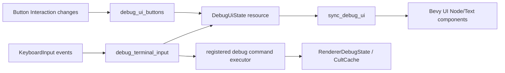

# Bevy Debug UI

The Bevy host has a deliberately small debug escape hatch. It is not the
aquarium's main interaction grammar; it is the place for knobs, diagnostics, and
developer commands while the diegetic UI grows up.

## Shape

- A top-left `>_` square is always visible.
- Pressing it opens a horizontal row of square tab buttons.
- The active tab opens a panel on the left half of the screen, offset so the
  launcher column and tab row still have room.
- The first tab is `Terminal`.

The terminal is an in-process debug command surface. It does not execute
PowerShell, `cmd`, or arbitrary shell text. Unknown commands are rejected.

Registered commands currently live in `bevy-aquarium/src/main.rs`:

- `help`
- `clear`
- `renderer`

`renderer` can inspect or change the persisted renderer debug mode:

```text
renderer
renderer list
renderer next
renderer normals
renderer irradiance-luminance
```

## Safety Boundary

The terminal should remain a registered-command DSL unless the user explicitly
asks for a shell tab.

Do not route unknown text to the operating system. Shell execution is too broad
for a hot debug panel, and it blurs three boundaries at once: renderer knobs,
developer commands, and arbitrary machine control. That can return later as a
separate, loudly labeled tool with confirmation and logging. The default debug
terminal should be boring, explicit, and hard to surprise.

## Bevy UI Model

This is Bevy UI, enabled through the `bevy_ui` feature.

It is DOM-like in the useful sense:

- UI is a tree of entities.
- Parent/child hierarchy defines layout containment.
- `Node` stores style and layout data.
- `Button` entities emit `Interaction` changes.
- `Text`, `TextFont`, and `TextColor` define text.
- Marker components name the parts systems care about.

It is not a browser DOM:

- There is no HTML parser, CSS cascade, or JavaScript event loop.
- State lives in ECS resources and components.
- Systems mutate UI nodes and text from typed queries.
- Layout is Bevy's UI layout engine, not web CSS.

The camera entity carries `IsDefaultUiCamera` so Bevy knows which camera renders
the UI overlay.

## Runtime Data Flow



The important invariant: while the terminal owns keyboard focus, camera input
returns early. Typing `renderer normals` should not also pan the Grid with the
`WASD` keys.

## Adding A Command

1. Add an entry to `DEBUG_COMMANDS`.
2. Add a match arm in `execute_debug_command`.
3. Return a `DebugCommandResult`.
4. If the command changes persistent app state, write through CultCache at the
   same time.
5. Keep command output line-oriented and short. This is a terminal leaf, not a
   dumping ground pretending to be architecture.

## Adding A Tab

1. Add a `DebugTab` variant.
2. Add marker components for the tab button and panel contents.
3. Spawn the tab button in `spawn_debug_ui`.
4. Spawn the panel contents in `spawn_debug_ui` or a small helper.
5. Teach `debug_ui_buttons` how to select it.
6. Teach `sync_debug_ui` how to show/hide and refresh it.

If a tab starts needing real state, give it a resource instead of stuffing
everything into `DebugUiState`.
